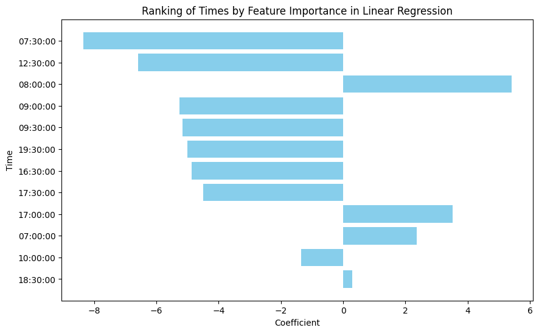

# Wodify Training

This is a training repository for Wodify. it contains files to accuratley predict
the attendance based on previous data.

## Requirements

Use the Poetry package manager to install the dependencies with python 3.12.

## Scraping

Because it is not possible to obtain an API key from Wodify itself, we will scrape the data from the website. The data is stored in the `data` folder. This must be the calender view page for each week, this is the page source in html for each week.

I will not demonstrate this.

## Modelling

The models are various ML models including a linear regression model, a random forest model and a neural network model. The models are trained and compared in the `model.ipynb` notebook.

## Configuration

When running with 3417 data points from the last two years the random forest model is
the best model with the following parameters:

```python
Best Model based on Composite Score:
Model: random_forest_regressor
Parameters: ('friedman_mse', 'log2', 21)
Composite Score: 0.3333330982873743
R^2 Score: 0.9999992948621228
MAE: 0.0007754949968064908
MSE: 1.5762720885672553e-05
RMSE: 0.003970229324065872
MAPE: 0.00011568850093440441
Explained Variance: 0.999999295415695
```

## Analysis of features

This removes features that may be sensitive.

The most important features are:

```python
                          Feature   Coefficient  Absolute Coefficient
7                   time_07:30:00 -8.357519e+00          8.357519e+00
2                   workout_Hyrox  7.626710e+00          7.626710e+00
12                  time_12:30:00 -6.579259e+00          6.579259e+00
0                workout_CrossFit  5.707398e+00          5.707398e+00
8                   time_08:00:00  5.412086e+00          5.412086e+00
9                   time_09:00:00 -5.252320e+00          5.252320e+00
10                  time_09:30:00 -5.161299e+00          5.161299e+00
17                  time_19:30:00 -4.996107e+00          4.996107e+00
13                  time_16:30:00 -4.872937e+00          4.872937e+00
15                  time_17:30:00 -4.500021e+00          4.500021e+00
4                workout_Red Room  3.758166e+00          3.758166e+00
14                  time_17:00:00  3.520162e+00          3.520162e+00
19                   day_SATURDAY  3.178964e+00          3.178964e+00
5   workout_THURSDAY NIGHT LIGHTS  3.160581e+00          3.160581e+00
6                   time_07:00:00  2.361928e+00          2.361928e+00
23                  day_WEDNESDAY  2.303917e+00          2.303917e+00
22                    day_TUESDAY -2.239055e+00          2.239055e+00
20                     day_SUNDAY -2.007259e+00          2.007259e+00
11                  time_10:00:00 -1.349989e+00          1.349989e+00
...
32                       duration  1.886751e-02          1.886751e-02
33                           year  2.081828e-04          2.081828e-04
34                          month  4.114283e-07          4.114283e-07
```

Which leads to some nice graphs:



## Conclusion

The random forest model is the best model for predicting attendance. The most important features are the time of the workout, the workout itself and the day of the week. The duration of the workout is also important. The year and month are not important features.

If you want a quiet workout go to the 7.30am open gym on a Saturday. 